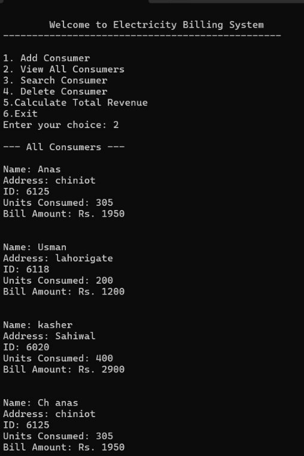
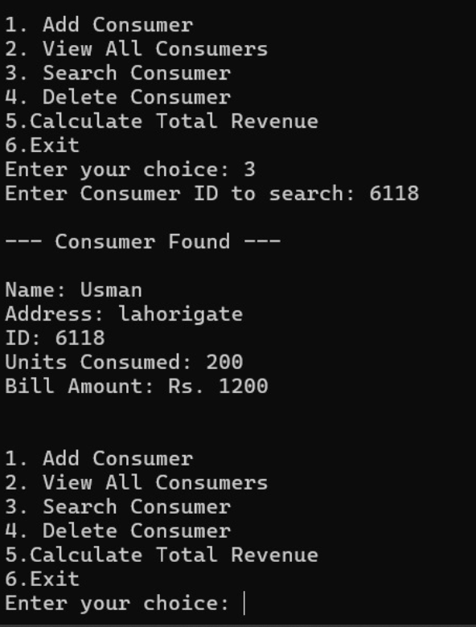
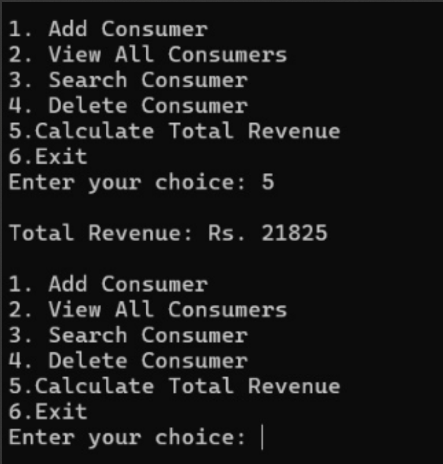
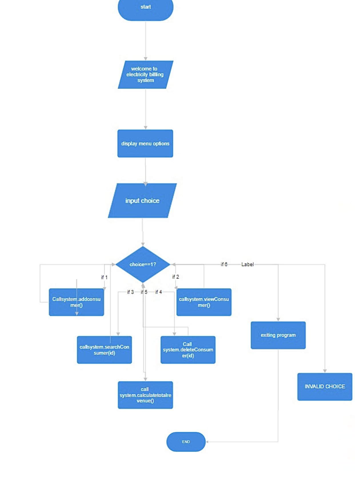
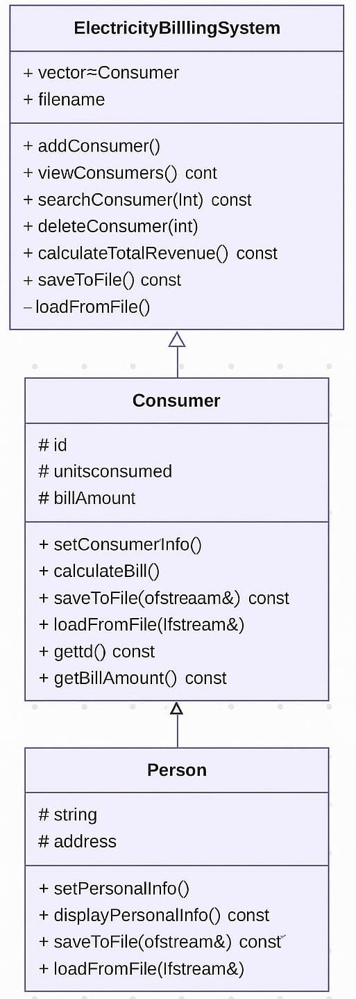

# ⚡ Electricity Billing System

A console-based Electricity Billing System developed in **C++** using **Object-Oriented Programming (OOP)** principles as part of the Programming Fundamentals Lab at **FAST-NUCES, Chiniot-Faisalabad Campus**.

---

## 📋 Project Overview

This system simulates a real-world electricity billing environment. It allows users to manage consumer records, calculate bills based on a slab system, and persist data using file handling.

---

## ✨ Features

- ➕ Add new consumer records
- 👁️ View all consumers and their bills
- 🔍 Search consumer by ID
- 🗑️ Delete consumer record
- 💰 Calculate total revenue
- 💾 File handling for persistent data storage (data saved between sessions)

---

## 🧮 Billing Slab System

| Units Consumed | Rate per Unit |
|----------------|--------------|
| 0 – 100 units  | Rs. 5/unit   |
| 101 – 300 units | Rs. 7/unit  |
| Above 300 units | Rs. 10/unit |

---

## 🏗️ OOP Structure

```
Person (Base Class)
└── Consumer (Derived Class)
        └── ElectricityBillingSystem (Main System Class)
```

- **Person** — stores name and address
- **Consumer** — extends Person with ID, units consumed, and bill calculation
- **ElectricityBillingSystem** — manages all consumers, file I/O, and menu

---

## 📸 Screenshots

### Program Menu & View All Consumers


### Search Consumer by ID


### Delete Consumer


### Total Revenue Calculation


### Flowchart


### UML Class Diagram


---

## 🚀 How to Run

1. Clone the repository:
```bash
git clone https://github.com/muhammad-anas-ee/Electricity-Billing-System.git
```

2. Compile the code:
```bash
g++ ElectricityBillingSystem.cpp -o ElectricityBillingSystem
```

3. Run the program:
```bash
./ElectricityBillingSystem
```

---

## 🛠️ Technologies Used

- **Language:** C++
- **Concepts:** OOP, Inheritance, Encapsulation, File Handling, Vectors, STL

---

## 👨‍💻 Developed By

| Name | Student ID |
|------|-----------|
| Muhammad Anas | 24F-6125 |
| Muhammad Anus | 24F-6119 |
| Muhammad Usman | 24F-6118 |

**Submitted to:** Engr. Bakhtawar Saeed — Lecturer, EE Department  
**Course:** CL1002 – Programming Fundamentals Lab  
**University:** FAST-NUCES, Chiniot-Faisalabad Campus
